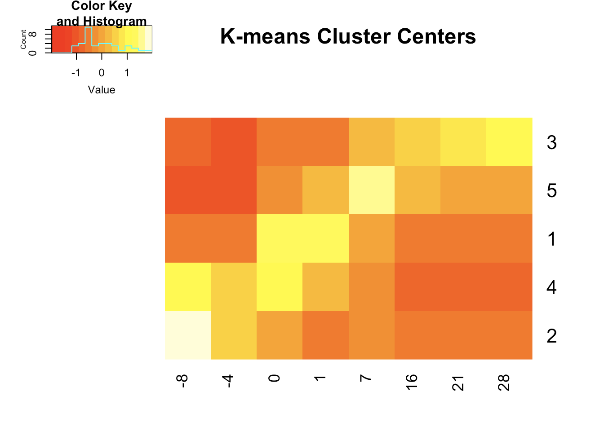
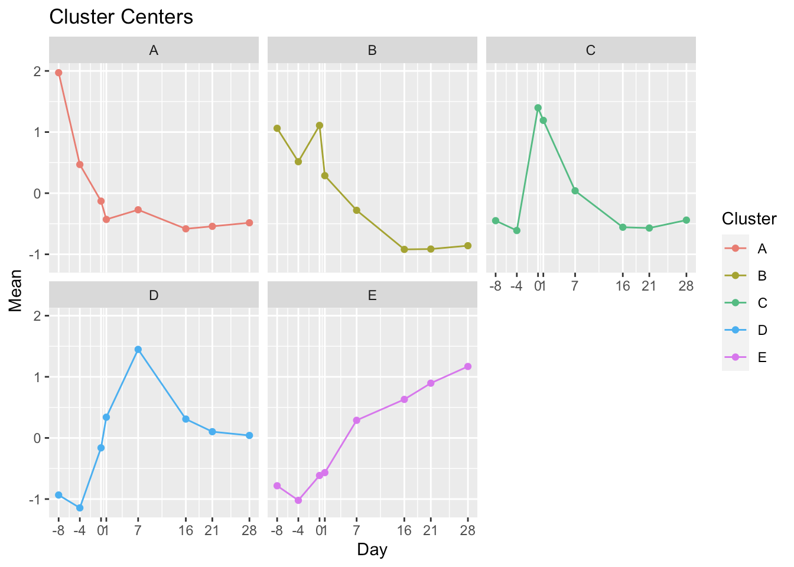
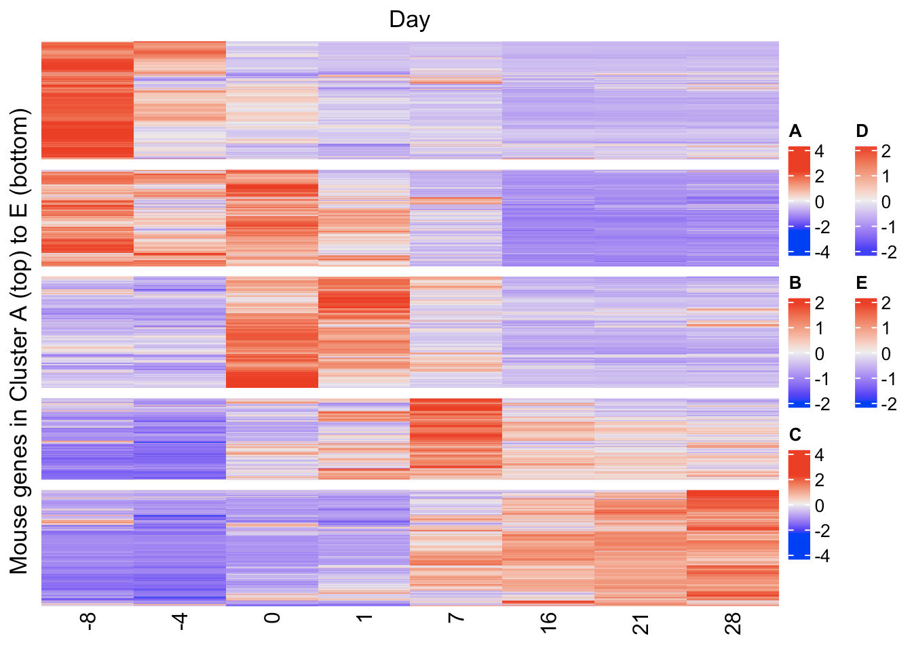
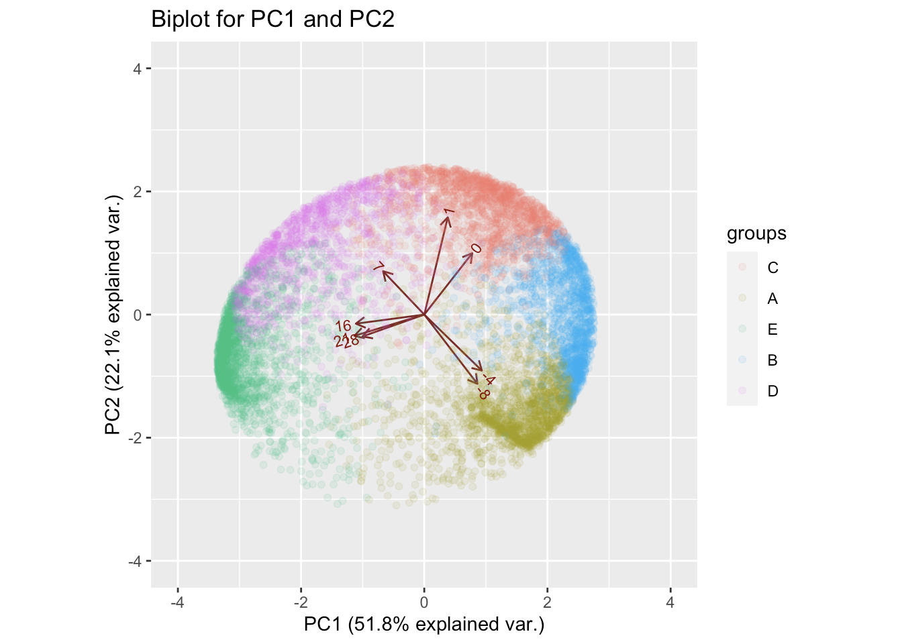
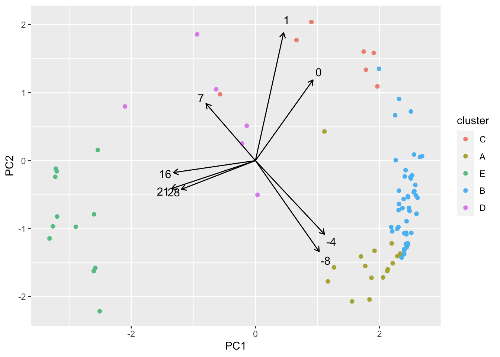
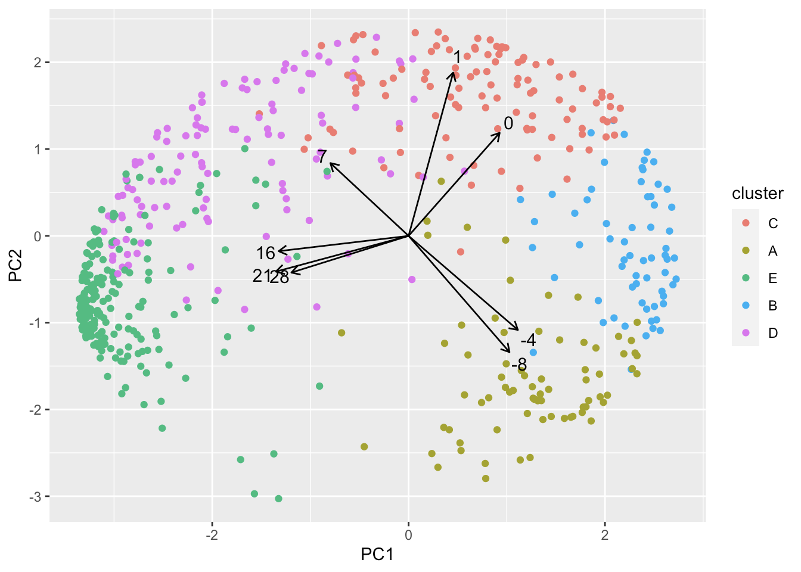

## Introduction

From [WHO](https://www.who.int/news-room/fact-sheets/detail/zika-virus), Zika 
virus disease is caused by a virus transmitted primarily by Aedes mosquitoes, 
which bite during the day. 
Symptoms are generally mild and include fever, rash, conjunctivitis, muscle and
joint pain, malaise or headache. 
Symptoms typically last for 2–7 days. 
Most people with Zika virus infection do not develop symptoms. 
Zika virus infection during pregnancy can cause infants to be born with 
Microcephaly and other congenital malformations, known as congenital Zika 
syndrome. 
Infection with Zika virus is also associated with other complications of 
pregnancy including preterm birth and miscarriage. An increased risk of 
neurologic complications is associated with Zika virus infection in adults and 
children, including Guillain-Barré syndrome, neuropathy and myelitis.

Researchers led by Dr. Bennett used existing data from in-vitro models of human 
brain development based on embryonic stem cells to understand when embryos are 
particularly susceptible to Zika infection resulting in Microcephaly. 
These models produce the layers of the cerebral cortex in a petri dish. 
The study is uses data from the [Cortecon](http://cortecon.neuralsci.org/) that
consists of RNA transcription data measured as the layers of the cerebral cortex
develop at nine different time points between 0 and 77 days. 
An analysis of this data was published in a 2019 paper in the journal 
[Nature](https://www.nature.com/articles/s41598-019-39318-8). 
The prior study found that in humans that genes associated with microcephaly are
enriched for the Neuroectoderm Stage (Cluster 2). 
Genes associated with microcephaly and changed by Zika infection have an even 
stronger enrichment. 
This suggests that human embryos are particularly susceptible to Zika-induced 
microcephaly in the first trimester, possibly before the mother even know she is
pregnant.

Clustering was used to identify the stages of development in humans. 
Principal component analysis (PCA), data visualization, and log odds ratio 
analysis were used to show when these stages occur. 
An advanced visualization, called a Susceptibility Window Ontological 
Transcription (SWOT) Clock, is available at 
[here](https://github.com/mpoegel/SemNExT-Visualizations). 
Given a set of genes associated with a disease, the SWOT clock can be used to 
help identify time periods of cortical development that may be susceptible to 
changes in those genes. 
Recall each cluster of gene represents a distinct stage of development, if a set
of genes occurs more than expected (a.k.a enriched) for a given stages then it 
is likely that brain development may be impacted by changes in the activities of
those genes during that stage. 
The SWOT Clock provides a visualization and a statistical analysis of the log 
odds ratio of each cluster along with its p-value. 
Since the set of disease genes are significantly enriched in a cluster, then the
time period associated with that cluster is a window of susceptibility. 
A cluster is significantly enriched if it has a positive log odds ratio and a 
p-value < 0.1.

Perform the windows of susceptibility (WOS) analysis based on mouse data from a 
similar brain-in-a-dish model for mice instead of human data used by 
Dr. Bennett. 
Analyze the same sets of microcephaly-associated genes and Zika-associated genes
to see if we can detect a similar WOS for Microcephaly and Zika-induced 
microcephaly in mice as in humans. 
Same technique also applied to cognitive disorders, anther disease that impacts 
mental function, to see if we get a similar result.

## Stages of Development Analysis

### Preparation of the Mouse Homologs Data

Scott the Scientist did an analysis of RNA-Seq data from the development of the
mouse cortex at days -8, -4, 0, 1, 7, 16, 21, and 26 taken from 
[Allen Brain Map Developing Mouse Brain Atlas](http://developingmouse.brain-map.org/).
This type of data is know as time series data since the features are taken 
through time.

We begins by reading in the data and preparing the data frame. 
The columns are days at which the samples are collected where `DayNegN`, `Day0`,
and `DayPosN` means N days before birth, day of birth, and N days after birth. 
The entries in the columns are the amount of RNA for each gene detected on that 
day in the mouse embryo cerebral cortex. 
We then change the columns' name to their actual meaning and create a matrix for
future analysis.

```r
# read data as data frame
Mouse.df <- read.csv("data/MouseHomologData.csv", row.names = 1) 
head(Mouse.df)  # preview of the data frame
```

```plaintext
##            DayNeg8     DayNeg4        Day0     DayPos1    DayPos7    DayPos16
## A1BG   -0.54006172  1.62018517  1.62018517 -0.54006172 -0.5400617 -0.54006172
## A4GALT  0.77955207 -0.01579633  1.82626020  0.64704748 -0.6928331 -0.84321867
## AAAS    2.02780897  0.97337784  0.06271547 -0.47846790 -0.4818574 -0.70894012
## AADAT   0.05395975 -1.45584988  0.62811270 -0.77537230  1.9295261  0.05395975
## AAMP   -0.58236089 -1.82323478  0.59797889  1.49446830  0.1356618 -0.56373317
## AANAT  -0.44728620 -0.64756360 -0.11349053 -0.04673139  2.3966529 -0.04673139
##           DayPos21   DayPos28
## A1BG   -0.54006172 -0.5400617
## A4GALT -0.86458745 -0.8364241
## AAAS   -0.71097391 -0.6836630
## AADAT  -0.04173241 -0.3926037
## AAMP    0.11103932  0.6301806
## AANAT  -0.64756360 -0.4472862
```

```r
# change column name
colnames(Mouse.df) <- c("-8", "-4", "0", "1", "7", "16", "21", "28")
head(Mouse.df)  # preview of the data frame
```

```plaintext
##                 -8          -4           0           1          7          16
## A1BG   -0.54006172  1.62018517  1.62018517 -0.54006172 -0.5400617 -0.54006172
## A4GALT  0.77955207 -0.01579633  1.82626020  0.64704748 -0.6928331 -0.84321867
## AAAS    2.02780897  0.97337784  0.06271547 -0.47846790 -0.4818574 -0.70894012
## AADAT   0.05395975 -1.45584988  0.62811270 -0.77537230  1.9295261  0.05395975
## AAMP   -0.58236089 -1.82323478  0.59797889  1.49446830  0.1356618 -0.56373317
## AANAT  -0.44728620 -0.64756360 -0.11349053 -0.04673139  2.3966529 -0.04673139
##                 21         28
## A1BG   -0.54006172 -0.5400617
## A4GALT -0.86458745 -0.8364241
## AAAS   -0.71097391 -0.6836630
## AADAT  -0.04173241 -0.3926037
## AAMP    0.11103932  0.6301806
## AANAT  -0.64756360 -0.4472862
```

```r
# create matrix
Mouse.matrix <- as.matrix(Mouse.df)
```

Note that the data already been scaled so that the analysis can focus on the 
shape of the time series rather than specific magnitudes. 
We can confirm the scaling is successful by calculating the row means and making
sure their norm was near 0.

```r
norm(rowMeans(Mouse.matrix))
```

```plaintext
## [1] 6.127969e-08
```

### K-means Clustering

We used [K-means clustering](https://en.wikipedia.org/wiki/K-means_clustering) 
to create five clusters based on domain knowledge: biologists believe there are 
five stages of brain development, so we select five clusters.

```r
# K-means clustering
set.seed(300)
km <- kmeans(Mouse.matrix, 5)
```

Then, examining the heat map of the K-means cluster centers, we can see that 
each cluster corresponds to different average peaks of gene expressions.

```r
# plot the heat map
heatmap.2(
  x = km$centers, Colv = FALSE,
  dendrogram = "none", trace ="none",
  main = "K-means Cluster Centers",
)
```



Note that the order of the cluster is `2`, `4`, `1`, `5`, `3` from the heat map.
Thus, we rearrange the order of cluster to `2`, `4`, `1`, `5`, `3` and rename 
them as `A`, `B`, `C`, `D`, `E`.

```r
# reorder and rename the "km$centers"
km$centers  # before reorder and rename
```

```plaintext
##           -8         -4          0          1           7         16         21
## 1 -0.4496261 -0.6106791  1.3974736  1.1913655  0.03916353 -0.5570030 -0.5703216
## 2  1.9712955  0.4686750 -0.1298583 -0.4293038 -0.27156219 -0.5828320 -0.5422287
## 3 -0.7822509 -1.0207248 -0.6142838 -0.5672292  0.28858510  0.6305905  0.8961737
## 4  1.0614302  0.5152264  1.1091815  0.2865445 -0.28002391 -0.9195562 -0.9137313
## 5 -0.9336692 -1.1442140 -0.1620285  0.3392103  1.44873958  0.3088564  0.1023566
##            28
## 1 -0.44037268
## 2 -0.48418548
## 3  1.16913936
## 4 -0.85907127
## 5  0.04074883
```

```r
km$centers <- km$centers[c('2', '4', '1', '5', '3'), ]
rownames(km$centers) <- c('A', 'B', 'C', 'D', 'E')
km$centers  # after reorder and rename
```

```plaintext
##           -8         -4          0          1           7         16         21
## A  1.9712955  0.4686750 -0.1298583 -0.4293038 -0.27156219 -0.5828320 -0.5422287
## B  1.0614302  0.5152264  1.1091815  0.2865445 -0.28002391 -0.9195562 -0.9137313
## C -0.4496261 -0.6106791  1.3974736  1.1913655  0.03916353 -0.5570030 -0.5703216
## D -0.9336692 -1.1442140 -0.1620285  0.3392103  1.44873958  0.3088564  0.1023566
## E -0.7822509 -1.0207248 -0.6142838 -0.5672292  0.28858510  0.6305905  0.8961737
##            28
## A -0.48418548
## B -0.85907127
## C -0.44037268
## D  0.04074883
## E  1.16913936
```

```r
# rename the "km$cluster"
head(km$cluster)  # before rename
```

```plaintext
##   A1BG A4GALT   AAAS  AADAT   AAMP  AANAT 
##      4      4      2      5      1      5
```

```r
km$cluster <- as.factor(km$cluster)
levels(km$cluster) <- c('C', 'A', 'E', 'B', 'D')
head(km$cluster)  # after rename
```

```plaintext
##   A1BG A4GALT   AAAS  AADAT   AAMP  AANAT 
##      B      B      A      D      C      D 
## Levels: C A E B D
```

### Cluster Visualization

We can see the time trends in the clusters means by plotting each cluster mean 
as a line. 
The cluster means have to be reformatted into a data frame with columns Cluster,
Day and Mean. 
This is done using the `dplyr` package `gather()` command. 
Then, we use the reformatted data frame and `ggplot` with `geom_line()` to make 
the plots. 
Note our use of `facet_wrap()` to generate individual plots by `Cluster`.

```r
# reformatted
head(as.data.frame(km$centers))  # before reformatted
```

```plaintext
##           -8         -4          0          1           7         16         21
## A  1.9712955  0.4686750 -0.1298583 -0.4293038 -0.27156219 -0.5828320 -0.5422287
## B  1.0614302  0.5152264  1.1091815  0.2865445 -0.28002391 -0.9195562 -0.9137313
## C -0.4496261 -0.6106791  1.3974736  1.1913655  0.03916353 -0.5570030 -0.5703216
## D -0.9336692 -1.1442140 -0.1620285  0.3392103  1.44873958  0.3088564  0.1023566
## E -0.7822509 -1.0207248 -0.6142838 -0.5672292  0.28858510  0.6305905  0.8961737
##            28
## A -0.48418548
## B -0.85907127
## C -0.44037268
## D  0.04074883
## E  1.16913936
```

```r
reformatted.df <- as.data.frame(km$centers) %>% 
  rownames_to_column("Cluster") %>% #  Make a new column called Cluster
  gather(key="Day",value="Mean", -Cluster) %>%
  convert(int(Day))  # convert Day to an integer
head(reformatted.df)  # after reformatted
```

```plaintext
## # A tibble: 6 × 3
##   Cluster   Day   Mean
##   <chr>   <int>  <dbl>
## 1 A          -8  1.97 
## 2 B          -8  1.06 
## 3 C          -8 -0.450
## 4 D          -8 -0.934
## 5 E          -8 -0.782
## 6 A          -4  0.469
```

```r
# plotting each cluster mean
ggplot(reformatted.df,aes(x=Day, y=Mean, col=Cluster)) +
  geom_line() + geom_point() +
  scale_x_continuous(breaks=c(-8,-4,0,1,7,16,21,28)) +
  labs(title="Cluster Centers") +
  facet_wrap(Cluster ~.)  # Use facet_wrap to make a separate plot for each cluster

rm(reformatted.df)  # clean environment
```



We can also make separate heat map for mouse genes in each of the five clusters 
and put them vertically from `A` to `E` (top to bottom) by 
[Hearmap](https://github.com/jokergoo/ComplexHeatmap). 
It's easy to see a shift of higher value from cluster `A` to `E`.

```r
heatmapList <- NULL
for (i in c('A', 'B', 'C', 'D', 'E')){
  heatmapList = heatmapList %v% Heatmap(
    Mouse.matrix[km$cluster==i,], name = i, 
    show_row_dend= FALSE, show_column_dend= FALSE, 
    show_row_names=FALSE, cluster_columns = FALSE,
  )
}
draw(heatmapList, row_title = "Mouse genes in Cluster A (top) to E (bottom)", column_title = "Day")

rm(heatmapList)  # clean environment
```



### PCA Analysis

We visualize the cluster using a [biplot](https://en.wikipedia.org/wiki/Biplot) 
of two components generated by PCA which explain 74% of the variance.

```r
pca <- prcomp(Mouse.matrix, retx=TRUE, center=TRUE, scale=TRUE)
summary(pca)
```

```plaintext
## Importance of components:
##                           PC1    PC2    PC3     PC4     PC5     PC6     PC7
## Standard deviation     2.0364 1.3306 0.9370 0.66801 0.59296 0.54132 0.33712
## Proportion of Variance 0.5184 0.2213 0.1098 0.05578 0.04395 0.03663 0.01421
## Cumulative Proportion  0.5184 0.7397 0.8494 0.90521 0.94917 0.98579 1.00000
##                              PC8
## Standard deviation     3.306e-11
## Proportion of Variance 0.000e+00
## Cumulative Proportion  1.000e+00
```

We display the points in a `biplot`, colored according to the k-means cluster 
result. 
The projection of the points makes an interesting disc-type shape which is less 
dense in the middle, like a donut. 
We can see that the clusters are arranged in time order, or stage, around the 
disc, from `A` to `E`.

```r
t <- 1.2*max(abs(pca$x[,1:2]))  # x and y scale limits for the biplot
ggbiplot(
  pca,
  choices=c(1,2),  # Use PC1, PC2
  alpha=.1,        # Make dots transparent
  varname.adjust=1.5,  # Move variables names out a bit
  scale =0,       # Don't rescale data
  groups=as.factor(km$cluster)
) + ggtitle('Biplot for PC1 and PC2') + xlim(-t, t) + ylim(-t, t)
```



## WOS Analysis of Zika

We read Zika genes and show them on the cluster `biplot` of the mouse model.

```r
# get sample data
disease.df <- read.csv("data/Zikamicrocephaly_data.csv",row.names = 1)
disease_symbols <- intersect(as.character(disease.df$symbol), as.character(rownames(Mouse.df)))

label <- as.factor(km$cluster)
levels(label) <- c('C', 'A', 'E', 'B', 'D')
plot.df <- cbind.data.frame(pca$x, cluster=label)
myplot.df <- plot.df[disease_symbols,]

# biplot
ggplot() + 
  geom_point(data = myplot.df, 
             aes(x=PC1, y=PC2, color=cluster) ) +
  geom_segment(x=0, y=0, 
               aes(xend=3*pca$rotation[,1], yend=3*pca$rotation[,2]),
               arrow=arrow(length=unit(1/2,'picas')) ) + 
  geom_text(aes(x=3.3*pca$rotation[,1], 
                y=3.3*pca$rotation[,2], 
                label=c("-8","-4","0","1","7","16","21","28")), 
            size=4)
```



Def `cluster_pvals` to calculate p-value and log-odds of each cluster. 
The code come from the Lab5 handout from Dr. Bennett.

```r
# Define cluster_pvals; DO NOT CHANGE!
cluster_pvals <- function(k, km, myplot.df) {
  # Inputs: k, km, myplot.df 
  # Returns: results (dataframe with clusters, pvalues, logodds)
  # Set the p-value and logodds to 0
  pvalue <- zeros(k,1)
  logodds <- zeros(k,1)
  results <- cbind.data.frame(cluster=1:k, pvalue, logodds)
  classdisease <- zeros(k,1)
  classall <- as.vector(table(km$cluster))
  # use dplyr to calculate counts for each cluster 
  temp <- myplot.df %>% 
    dplyr::group_by(cluster) %>% 
    dplyr::count(name="freq")  # Creates 'freq' column!
  classdisease[temp$cluster] <- temp$freq
  classlogodds <- zeros(k,2)
  totaldisease <- sum(classdisease)
  totalall <- sum(classall)
  # Calculate the log odds ratio for the disease
  for (i in 1:k) {
    n11 <- classdisease[i] +1                # genes in disease in cluster i 
    n21 <- totaldisease- classdisease[i] +1  # genes in disease not in cluster i
    n12 <- classall[i]-n11+1                 # genes not in disease and in cluster i
    n22 <- totalall- n11-n21 -n12+1;         # genes not in disease and not in cluster 
    res <- fisher.test(matrix(c(n11,n21,n12,n22), 2, 2))
    results[i,]$pvalue <- res$p.value
    results[i,]$logodds<- log((n11*n22)/(n12*n21))
  }
  return(results)
}
```

Next we use the help function `cluster_pvals` to calculate the log odds ratio of
Zika disease for each cluster.

```r
# Apply cluster_pvals using the parameters just generated
clusters <- cluster_pvals(5, km, myplot.df)

# Helper function to determine enrichment
threshold <- 0.1  # Normally set to 0.1
enriched <- function(p.value,logodds,p.threshold=0.1) {
  if ((p.value <= p.threshold) && (logodds > 0)) {
    return(TRUE)
  } 
  else {
    return(FALSE)
  }
}

# Evaluate across our results; create new column
clusters$enriched <- mapply(enriched, clusters$pvalue, clusters$logodds,threshold)

# rename the cluster name of the output matrix
clusters$cluster[clusters$cluster==2]<-"A"
clusters$cluster[clusters$cluster==4]<-"B"
clusters$cluster[clusters$cluster==1]<-"C"
clusters$cluster[clusters$cluster==5]<-"D"
clusters$cluster[clusters$cluster==3]<-"E"

# View results
kable(clusters)
```

| **cluster** | **p-value** | **log-odds** | **enriched** |
| ----------- | ----------- | ------------ | ------------ |
| C           | 0.0026364   | \-1.0289834  | FALSE        |
| A           | 0.6139669   | \-0.1544676  | FALSE        |
| E           | 0.0958240   | \-0.5265662  | FALSE        |
| B           | 0.0000000   | 1.5996365    | TRUE         |
| D           | 0.0400381   | \-0.7896979  | FALSE        |

From the result, we see the stage `B` is enriched since it has a positive log 
odds ratio and a p-value < 0.1. 
Thus, for Zika disease, stage `B` is the most susceptible period base on the 
mouse model, which is same to the WOS in human model.

## WOS Analysis of Cognitive Disorder

Same process as above, we read cognitive disorder genes and show them on the 
cluster biplot of the mouse model.

```r
# get sample data
disease.df <- read.csv("data/Cognitive disorder_heat_map_data.csv",row.names = 1)
disease_symbols <- intersect(as.character(disease.df$symbol), as.character(rownames(Mouse.df)))

label <- as.factor(km$cluster)
levels(label) <- c('C', 'A', 'E', 'B', 'D')
plot.df <- cbind.data.frame(pca$x, cluster=label)
myplot.df <- plot.df[disease_symbols,]

# biplot
ggplot()+
  geom_point(data = myplot.df, 
             aes(x=PC1, y=PC2, color=cluster) )+
  geom_segment(x=0, y=0, 
               aes(xend=3*pca$rotation[,1], yend=3*pca$rotation[,2]),
               arrow=arrow(length=unit(1/2,'picas')) )+ 
  geom_text(aes(x=3.3*pca$rotation[,1], 
                y=3.3*pca$rotation[,2], 
                label=c("-8","-4","0","1","7","16","21","28")), 
            size=4)
```



Next we use the help function `cluster_pvals` provides in lab 5 handout and 
defines above to calculate the log odds ratio of cognitive disorder disease 
for each cluster.

```r
# Apply cluster_pvals using the parameters just generated
clusters <- cluster_pvals(5, km, myplot.df)

# Helper function to determine enrichment
threshold <- 0.1  # Normally set to 0.1
enriched <- function(p.value,logodds,p.threshold=0.1) {
  if ((p.value <= p.threshold) && (logodds > 0)) {
    return(TRUE)
  } 
  else {
    return(FALSE)
  }
}

# Evaluate across our results; create new column
clusters$enriched <- mapply(enriched, clusters$pvalue, clusters$logodds,threshold)

# rename the cluster name of the output matrix
clusters$cluster[clusters$cluster==2]<-"A"
clusters$cluster[clusters$cluster==4]<-"B"
clusters$cluster[clusters$cluster==1]<-"C"
clusters$cluster[clusters$cluster==5]<-"D"
clusters$cluster[clusters$cluster==3]<-"E"

# View results
kable(clusters)
```

| **cluster** | **pvalue** | **logodds** | **enriched** |
| ----------- | ---------- | ----------- | ------------ |
| C           | 0.1679806  | \-0.1574106 | FALSE        |
| A           | 0.0000000  | \-0.6771831 | FALSE        |
| E           | 0.0000000  | 0.7325017   | TRUE         |
| B           | 0.0000031  | \-0.5988984 | FALSE        |
| D           | 0.0003173  | 0.3992603   | TRUE         |

The result shows that stages `D` and `E` are enriched, which is the most 
susceptible period for Cognitive Disorder. 
In human data, the last stage, upper layers, is enriched. 
Thus, the mice and human results are match: they both enriched at the end stage.

## Conclusions

We got similar WOS result in human and mouse model for both Zika and cognitive 
disorder. 
For Zika virus, analysis in both models show the second stage is most 
susceptible. 
The last stage, the upper layers stage, is most susceptible for the cognitive 
disorders in human model where the stages `D` and `E` are most susceptible in 
mouse model, which is also end stage.

## Acknowledgements

This is a mini project for the *MATP 4400 Data Introduction to Data Mathematics*
by Dr. [Kristin Bennett](https://www.linkedin.com/in/kristin-bennett-b337637/) 
and Dr. [John Erickson](https://www.linkedin.com/in/olyerickson/), Spring 2022, 
at [Rensselaer Polytechnic Institute](https://www.rpi.edu), Troy, NY. 
The background and goal of the project is given in *IDM Lab 5: Mini Project*. 
The structure of this report is revise on the basis of *PreLab 5* and *Lab 5* 
templates given by instructors. 
Dr. Bennett and Dr. Erickson gave perfect instruction about all the methods 
including K-meaning clustering, PCA, and log odds ratio analysis and R 
visualization techniques in MATP 4400.
